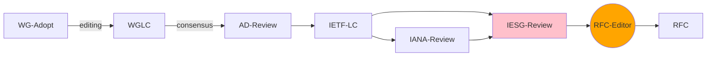

# uuidrev - Revise Universally Unique Identifier Definitions

* Friday, 06 October 2023, 8:00 PST, 11:00 EDT, 1500 UTC.

### INFO:

info: https://datatracker.ietf.org/wg/uuidrev/meetings/

Meetecho: https://meetings.conf.meetecho.com/interim/?short=b85d9b68-3e38-43dc-83ee-1b58f9e920ec
Notes:    https://notes.ietf.org/notes-ietf-interim-2023-uuidrev-04-uuidrev

note that chat is now Zulip:
   https://zulip.ietf.org/login/#narrow/stream/uuidrev
but is accessible via meetecho interface.

# AGENDA

## Hello, logistics, expected schedule of work.

## NoteWell.
    https://www.ietf.org/about/note-well/

## Code of Conduct
    BCP 54 / RFC 7154
    1. Treat colleagues with respect
    2. Speak slowly and limit the use of slang
    3. Dispute ideas by using reasoned argument
    4. Use best engineering judgment
    5. Find the best solution for the whole Internet
    6. Contribute to the ongoing work of the group and the IETF

## Status Update on WG documents

## IANA considerations needs

https://github.com/ietf-wg-uuidrev/rfc4122bis/issues/144

## open and closed issues from sectorial reviews

## UUIDv9 issues

## discussion and chair questions

## Open Mic and AOB

